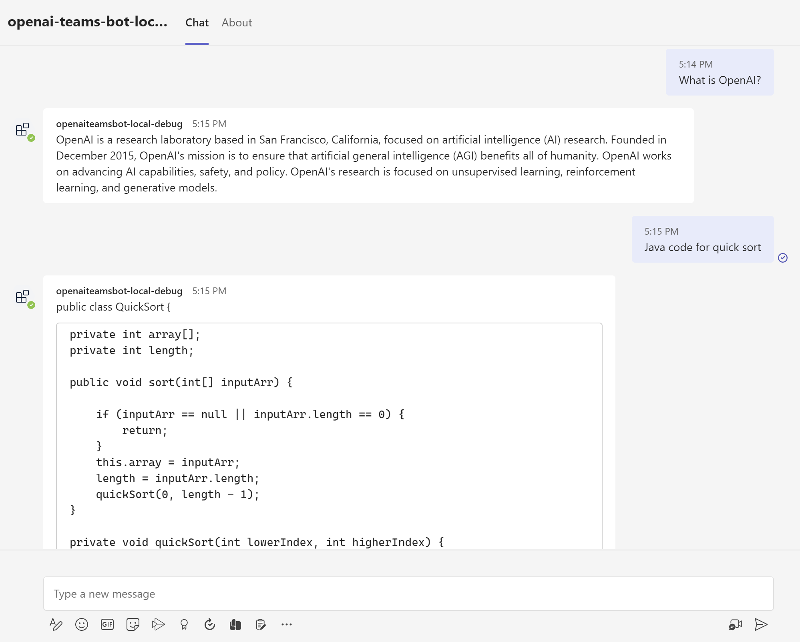

# How to use this OpenAI Teams Bot app

This is An OpenAI Teams Bot app to let you chat with OpenAI API in Microsoft Teams.



## Prerequisites

- An [OpenAI](https://openai.com/api/) account
- [NodeJS](https://nodejs.org/en/) (Tested on Node.js 18.12.1)
- An M365 account. If you do not have M365 account, apply one from [M365 developer program](https://developer.microsoft.com/en-us/microsoft-365/dev-program)
- Latest stable version of [Teams Toolkit Visual Studio Code Extension](https://aka.ms/teams-toolkit) (Tested on version 4.1.3)

## Get API key

Get an OpenAI API key from https://beta.openai.com/account/api-keys.

## Debug

- Create a `.env.teamsfx.local` file under `bot` folder, and set the OpenAI API key in `.env.teamsfx.local` file:
    ```
    OPENAI_API_KEY=xxxxxxxxxx
    ```
- From Visual Studio Code: Start debugging the project by hitting the `F5` key in Visual Studio Code. 
- Alternatively use the `Run and Debug Activity Panel` in Visual Studio Code and click the `Run and Debug` green arrow button.
- From TeamsFx CLI: Start debugging the project by executing the command `teamsfx preview --local` in your project directory.
